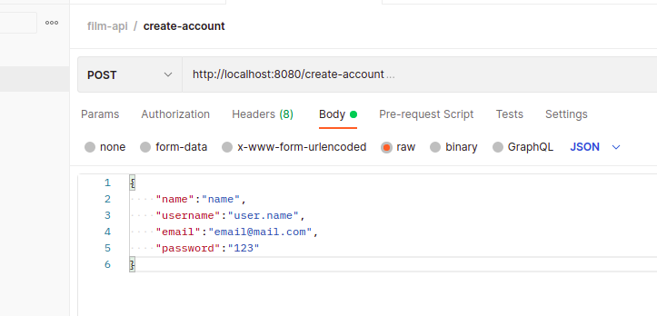
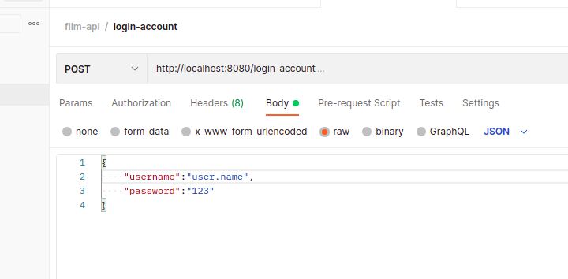

# coding-challenge-itau
Repositório dedicado ao desafio itaú devs

---
No projeto, foram criadas 2 API, a primeira, **film-review-api**, é uma aplicação que tem
como finalidade reunir opniões sobre determinado filme, armazenando notas, comentários e que permite interação entre 
as avaliações dos usuários. A seguna é a **security-api**, ela é nossa api de segurança, responsável por autenticar o usuário
e gerar um token JWT.

É importante mencionar que a security-api gera o token, mas não o valida posteriormente.
A responsablidade de validar o token fica para a api que consome nossa api de segurança, no caso a film-review-api.

---
## Meu abiente de desenvolvimento para este projeto:

- Ubuntu 20.04 LTS
- Java 11
- Docker 20.10.7
- Intellij IDEA Community
- Postman
- DBeaver

## Para rodar o projeto você vai precisar:

- Java **versão 11** ou superior instalado.

- Docker instalado

- IDE para Java


Para verificar a sua versão do JDK e docker, abra o terminal e entre com os comandos:
>java -version

>docker -v 

## Tendo isso você deve:

- Baixar o projeto
- Abra o projeto na IDE de sua escolha, abra um terminal interno da própria IDE
ou externo, desde que esteja na pasta raíz do projeto a coding-challenge-itau,
e entre com o comando:
> docker-compose up

no caso de sistemas linux, é provável que você tenha que rodar como administrador
> sudo docker-compose up 

Assim subirá um container mysql em seu computador na porta 3306, caso você tenha
o mysql instalado localmente e rodando nesta porta, pode trocar no application.yaml para 3307, por exemplo.

Com isso você já pode rodar as aplicações, primeiro, vá até: `film-review-api > src > java > com > filmreview` e abra
o arquivo `Application`  e dê um **run** nesta classe, no intellij o atalho para rodar as classes executáveis é Shift + F10.

Em seguida vá até a security-api, segue caminho: `security-api > src > java > com > security` e abra o 
arquivo `SecurityApplication`, basta rodar essa classe também.

A film-review-api vai rodar na porta 8080 e a security-api na 8081.

---
## Rotas publicas da aplicação:
`/create-account`

`/login-account`

## Crie um usuário

Agora você pode criar um usuário via Postman (Insomnia ou outro de sua preferẽncia) e testar as funcionalidades da aplicação.

Acesse a rota http://localhost:8080/create-account passando o body no formato Json, conforme exemplo abaixo:
```json
{
    "name":"name",
    "username":"user.name",
    "email":"email@mail.com",
    "password":"123"
}
```

<p align="center">

</p>

## Faça o login na conta criada:

Em seguida você deve logar na aplicação pela rota http://localhost:8080/login-account 
passando as credencias: username e password.

```json
{
    "username":"user.name",
    "password":"123"
}
```
<p align="center">

</p>

Como resposta dessa requisição você recebe um token, que te dará acesso as rotas privadas.

---

## Processo de geração do Bearer token
Ao acessar a rota `http://localhost:8080/login-account`, passando username e senha
no corpo da requisição, a film-review-api manda uma requisição para a security-api, 
`http://localhost:8081/login`, que valida as credenciais(username e senha) e gera um token 
a partir delas, esse token é recebido pela film-review-api e tornado ao usuário.

Com o token é possível  acessar as demais rotas da aplicação, 
passando o mesmo no cabeçalho das requisições.


---

### Abaixo segue o vídeo onde eu mostro como baixar, rodar e demonstro o fluxo de autentição do projeto.

https://youtu.be/GYwTBmdqa6A

---

## Explicando o projeto

A seguir vou apresentar as entidades e a ideia por tras delas, mostrando os atributos e omitindo os métodos.

## As classes


`Film`, a classe é composta por um title, imdbID que é o id externo da api que estamos consumindo para buscar os filmes,
rating que é a média das notas de cada review, e uma lista de review, que são as críticas/avaliações feitas pelos usuários para o filme em questão.

Apesar de buscarmos o filme numa api externa, após a busca e avaliação do mesmo, ele é salva na nossa base de dados pegando o nome e imdbID.

``` java
@Entity
@Table(name = "Films")
public class Film extends  AbstractEntity {

    private String title;

    @Column(name = "imdb_ID")
    private String imdbID;

    private Double rating = 0.0;

    @OneToMany(mappedBy = "film", cascade = CascadeType.ALL, fetch = FetchType.EAGER)
    private final List<Review> reviews = new ArrayList();

}
```

Review é a crítica do usuário, nela temos uma referência para reviewer, que é a pessoa que fez a crítica, uma lista de comentários,
a ideia é que o mesmo usuário possa deixar vários comentários, tipo: 

`assisti mil vezes, muito bom!!!`

`amo o leonardo dicaprio`

...

Completando temos uma nota e uma referência para film, pro mapeamento funcionar certinho.

``` java
@Entity
@Table(name = "Reviews")
public class Review extends AbstractEntity {

    @OneToOne
    @JoinColumn(name = "reviewer_id")
    private Reviewer reviewer;

    @OneToMany(mappedBy = "review", cascade = CascadeType.ALL, fetch = FetchType.EAGER)
    private final List<Comment> comments = new ArrayList<>();

    private Double grade;

    @ManyToOne
    @JoinColumn(name = "film_id")
    private Film film;

}
```

Comment são os nossos comentários, ela tem uma flag que diz se o comentário é repetido ou não, uma lista de 
`EvaluationComment` representando os like e dislikes desse comentário, `ReplyComment` as respostas do comentário e `QuoteComment` as citações. Uma referência para `review`

``` java
@Entity
@Table(name = "Comments")
public class Comment extends AbstractCommentEntity {

    private Boolean isRepeated = false;

    @OneToMany(mappedBy = "comment", cascade = CascadeType.ALL)
    private final List<EvaluationComment> evaluations = new ArrayList<>();

    @OneToMany(mappedBy = "comment", cascade = CascadeType.ALL)
    private final List<ReplyComment> replies = new ArrayList<>();

    @OneToMany(mappedBy = "comment", cascade = CascadeType.ALL)
    private final List<QuoteComment> quotes = new ArrayList<>();

    @ManyToOne
    @JoinColumn(name = "review_id")
    private Review review;
}
```

`EvaluationComment` é a classe responsável por receber o like/dislike do comentário, a ideia de trazer isso pra uma tabela separa e não simplesmente um inteiro na
tabela Comments, é de não permitir que o mesmo reviewer dê likes e dislikes indefinidamente no mesmo cometário, como essa classe contém referência para reviewer, que to chamando de sender, e comment, é possível saber se a pessoa já deixou uma avaliação para o comentário e não permitir a operação repetida.

``` java
@Entity
@Table(name = "Evaluations")
public class EvaluationComment extends AbstractEntity {

    @OneToOne
    @JoinColumn(name = "sender_id")
    private Reviewer sender;

    @Enumerated(EnumType.STRING)
    private EvaluationType type;

    @ManyToOne
    @JoinColumn(name = "comment_id")
    private Comment comment;
}

public enum EvaluationType {
    LIKE,
    DISLIKE
}
```
`ReplyComment` são as respostas deixas num comentário, guardando quem comentou.
``` java
@Entity
@Table(name = "Replies")
public class ReplyComment extends AbstractCommentEntity {

    @OneToOne
    @JoinColumn(name = "sender_id")
    private Reviewer sender;

    @ManyToOne
    @JoinColumn(name = "comment_id")
    private Comment comment;
}
```
`QuoteComment` são as citações
``` java
@Entity
@Table(name = "Quotes")
public class QuoteComment extends AbstractCommentEntity {

    @OneToOne
    @JoinColumn(name = "sender_id")
    private Reviewer sender;

    @ManyToOne
    @JoinColumn(name = "comment_id")
    private Comment comment;
}
```

`Reviewer` é a classe que representa os nossos usuáros, com suas informações de perfil.

``` java
@Entity
@Table(name = "Reviewers")
public class Reviewer extends AbstractEntity{

    private String name;

    private String username;

    private String email;

    private String password;

    private Integer score = 0;

    private LocalDateTime createdAt;

    @Enumerated(EnumType.STRING)
    private ProfileType profileType = ProfileType.READER;
}

```


## Listando todos os filmes salvos na minha base local de dados, após alguns testes dos endpoint:


``` json

[
	{
		"id": "217a8c62-7132-4f09-97d7-faa01035ef10",
		"imdbID": "tt0133093",
		"title": "The Matrix",
		"rating": 9.666666666666666,
		"reviews": [
			{
				"id": "07eb9c62-c651-41f5-99ea-2947271ace6f",
				"filmId": "217a8c62-7132-4f09-97d7-faa01035ef10",
				"grade": 10.0,
				"reviewer": {
					"id": "9bc03bd6-9ca6-420c-939b-328a09bbd617",
					"name": "rubens",
					"username": "rubens.lavor",
					"profile": "MODERATOR"
				},
				"comments": []
			},
			{
				"id": "6d5168e3-2d59-46d7-833a-d08e265ac6fd",
				"filmId": "217a8c62-7132-4f09-97d7-faa01035ef10",
				"grade": 10.0,
				"reviewer": {
					"id": "e8b77566-a9f0-4089-99ae-3572d7b2d4f5",
					"name": "rubens 3",
					"username": "rubens3.lavor",
					"profile": "BASIC"
				},
				"comments": []
			},
			{
				"id": "7d8eeb3e-18b4-43af-a48c-a063f3271b4f",
				"filmId": "217a8c62-7132-4f09-97d7-faa01035ef10",
				"grade": 9.0,
				"reviewer": {
					"id": "5276b37d-c8ad-4ae4-8462-0a0eee0692b0",
					"name": "rubens2",
					"username": "rubens2.lavor",
					"profile": "MODERATOR"
				},
				"comments": []
			}
		]
	},
	{
		"id": "6675a647-0206-4db5-9db9-cd4c322d7525",
		"imdbID": "tt1375666",
		"title": "Inception",
		"rating": 9.25,
		"reviews": [
			{
				"id": "1f39e496-7e62-4d9f-8c02-4de808fe4164",
				"filmId": "6675a647-0206-4db5-9db9-cd4c322d7525",
				"grade": 10.0,
				"reviewer": {
					"id": "e8b77566-a9f0-4089-99ae-3572d7b2d4f5",
					"name": "rubens 3",
					"username": "rubens3.lavor",
					"profile": "BASIC"
				},
				"comments": []
			},
			{
				"id": "7924ff36-a4e9-43f7-bb7a-200bb22cc221",
				"filmId": "6675a647-0206-4db5-9db9-cd4c322d7525",
				"grade": 8.5,
				"reviewer": {
					"id": "9bc03bd6-9ca6-420c-939b-328a09bbd617",
					"name": "rubens",
					"username": "rubens.lavor",
					"profile": "MODERATOR"
				},
				"comments": [
					{
						"id": "58a8deaf-dbf9-49c8-95fa-09c9e47c3fff",
						"description": "comentário para 'A Origem'",
						"like": 1,
						"dislike": 0,
						"createdAt": "2022-06-27T22:30:41.159976",
						"replies": [],
						"quotes": [],
						"repeated": false
					}
				]
			}
		]
	}
]

```

